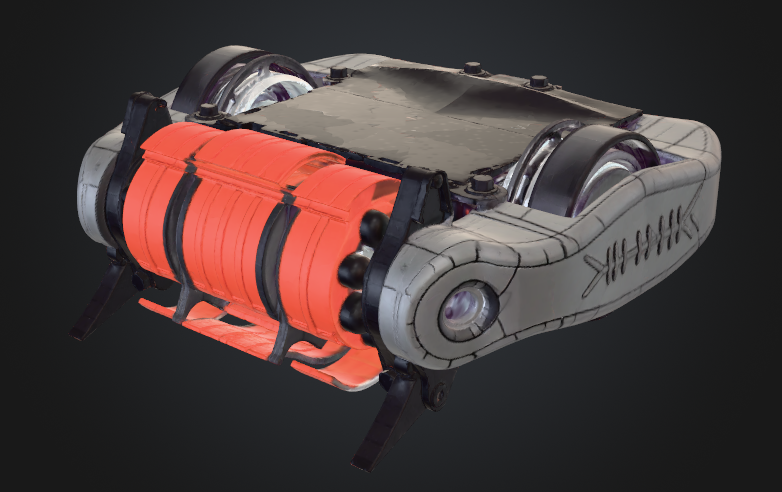

# Hado Titan — 8kg Robowar Combat Robot

A drum-spinner combat robot built for 8kg-category robowar competition

## Overview

Hado Titan is a fixed-unibody wedge chassis with a belt-driven weapon drum and full-height wheels for invertible driving. Design is inspired by [Nitro](https://forum.bristolbotbuilders.com/t/nitro-13-6kg-fc-drum-spinner/177), a well-documented 13.6kg FC drum spinner from the Bristol Bot Builders community — component classes and construction lessons are adapted from that build, not copied wholesale.

**Category:** 8kg Robowar
**Weapon type:** Belt-driven drum spinner, toggled on/off during matches (not continuous)
**Drive:** Two full-height wheels, reversible ESC for topple recovery
**Status:** Component sourcing + CAD in progress

## Why a drum spinner

The fixed front/rear wedges corner opponents for control while the drum — toggled on/off rather than run continuously — punishes any contact, whether or not the corner attempt succeeds. This gives the bot an active-defense element even when it isn't fully controlling an engagement.

## CAD
- `cad/CASE UHMWPE CONTAINER.SLDPRT` — 3D Design of the electronics casing
- `cad/Spinning drum FINAL.SLDPRT` — 3D Model of the Spinning Weapon Drum
- 'cad/ATTACHMENT LATCHES' - 3D Model of the metal supporting attachments for the CASE and the main CHASSIS 
Also includes various models of the electronics for reference purposes and split parts

##NET DIAGRAM OF THE SHEET METAL WORK FOR THE CASING
(docs/images/net.png)

## Bill of Materials

See [`bom/BOM_hado_titan_v3.xlsx`](bom/BOM_hado_titan_v3.xlsx) for the current priced + weighed component list (Major components are accounted as of now) 

**Sourcing:** Robu.in (batteries, receiver, wheels, bearings, fasteners, weapon/drive motors, reversible ESC) — India-based to avoid import customs delays on the funding timeline. I'm still facing some issues in fetching the battery of the specs I intended.

## Electronics

- **Weapon + drive ESC:** SmartElex 30D Smart Motor Driver + Readytosky 80A ESC 2-6S Brushless ESC
- **Weapon motor:** DYS D3548-5 900 KV BLDC Motor  **Drive motors:** Pro-Range 72.6 N-cm 468 RPM 24V Planetary Gear DC Motor PG36M555-19.2K(x2)
- **Radio:** FlySky FS-i6X (6CH) + FS-iA10B receiver
- **Battery:** Single GNB 4000mAh 6S1P 22.2V 50C Lipo Battery
- A rough circuit of the electronic connection (AI GENERATED IMAGE) 'circuit-diagram.svg'

Reverse capability was a hard requirement — if the bot topples mid-match, drive needs to work upside down without manual intervention.

## Ruleset compliance

- Dimension envelope: 500mm × 500mm × 800mm (l × b × h) at match start
- Weight limit: 8kg including all batteries, mechanics, and weapons	
- Voltage limit: 36V DC/AC max anywhere on the bot —  GNB 4000mAh 6S1P 22.2V 50C Lipo Battery keeps well clear of this
- No pneumatic weapons, so the tank-weight-multiplier rule doesn't apply

## Team

Built by a first-year BTech CSE student from IIIT Pune
## License

MIT — see [LICENSE](LICENSE)
